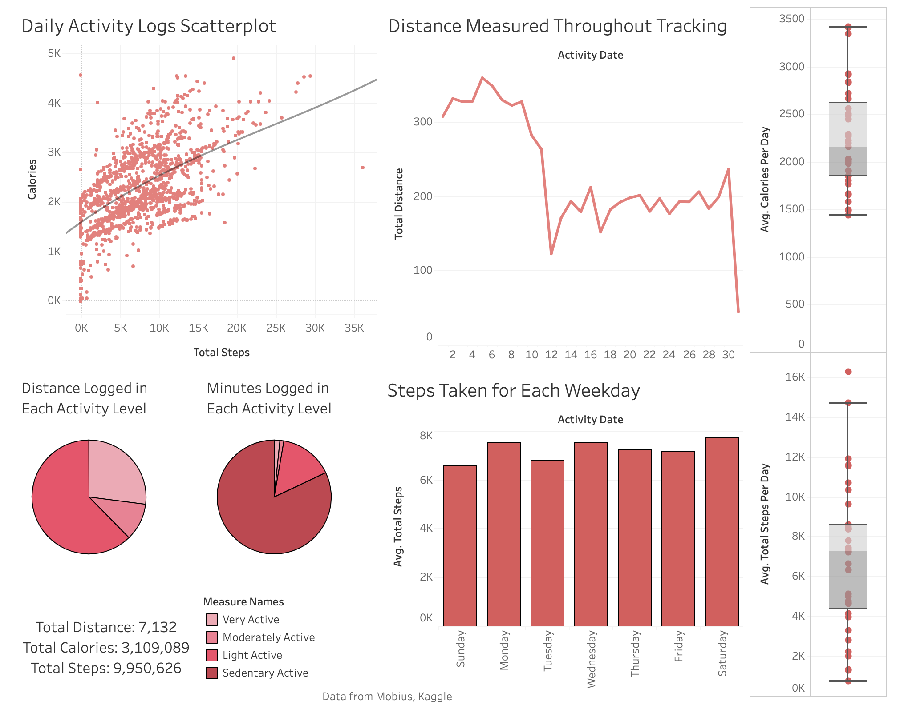

# BellaBeat Fitness Tracker Data Analysis, Case Study
## Dataset created by Mobuis and avalible on Kaggle [Link](https://www.kaggle.com/datasets/arashnic/fitbit)
### Analysis Completed By Brandon Lyons

##### Background

*Personal*
Hello everyone! My name is Brandon and I'm a computer science graduate from Florida Atlantic University. Fitness is a big part of my day to day life and I found this dataset very interesting to work with and analyze. I had fun manipulating and visualizing this data and working through the steps of the data analysis process, follow me on Linkedin - https://www.linkedin.com/in/brandon-lyons-8b6b04158

*Project Business*
Urška Sršen and Sando Mur founded Bellabeat, a high-tech company that manufactures health-focused smart products. Sršen used her background as an artist to develop beautifully designed technology that informs and inspires women around
the world. Collecting data on activity, sleep, stress, and reproductive health has allowed Bellabeat to empower women with knowledge about their own health and habits. Since it was founded in 2013, Bellabeat has grown rapidly and quickly positioned itself as a tech-driven wellness company for women.


##### Steps of The Analysis Process

* [Ask](#ask)
What is the problem we are trying to solve or what are the insights that we want figure out?

* [Prepare](#perpare) 
What data tables are we using from the zipped file? What programs and languages are we using? What are the datatypes and are they formatted correctly?

* [Process](#process)
Are there duplicate or NULL value rows? Are datatypes like dates and strings represented correctly and are the ordinal and discrete values correct? Are there any obvious mistakes to any of the data cells?

* [Analyze](#analyze)
In what ways can we use the data to gain insight into the questions being asked by the stakeholders? Are there any new attributes that we can make to help answer the questions. How can we filter and sort the data to find interesting subdata?

* [Share](#share)
What graphs and dashboards can be made to answer the stakeholder questions? 

* [Act](#act)
What are the recommendations that are pertinent to the questions being asked and how can they help the company?


## Ask

Stakeholder questions to be answered

1. What are some trends in smart device usage?
2. How can these trends apply to Bellabeat customers?
3. How could these trends help influence Bellabeat marketing strategy?

For this project it is recommended to select one of Bellabeats products to apply the analytics to for the final recommendations, I will choose the Leaf product. It is Bellabeats classic wellness tracker that can be worn as a bracelet, necklace or clip and tracks activity, sleep and stress.


## Prepare

This dataset comes with 29 data tables, but I will only be working with 3 of them in this project because some of them are redundant and I will only be working with the daily data for now

##### Metadata
* dailyActivity_merged first and second month
    * First Month
    Columns: 15
    Rows: 458
    Storage Space: 51 KB
    * Second Month
    Columns: 15
    Rows: 941
    Storage Space: 111 KB
* sleepDay_merged
    Columns: 5
    Rows: 414
    Storage Space: 18 KB

All data is stored in csv files that are not too big and can be accessed in both Excel and SQL, there are two separate daily activity files for each month that can be merged together to make the data more abundant and credible.

The data integrity of these data tables is not that good because having less than a thousand rows in each data table is not ideal when trying to get complex insights from it and is prone to bias. Especially because this data comes from less than 40 people and to get insights confidently it would be much better to have a lot more people and over more time.

##### Data Types
daily_Activity_Consolidated

* Primary Key: Id
* Dates: ActivityDate
* Ints: 6 of them
    * TotalSteps
    * VeryActiveMinutes
    * FairlyActiveMinutes
    * LightlyActiveMinutes
    * SedentaryMinutes
    * Calories
* Doubles, decimal numbers, 7 of them
    * TotalDistance
    * TrackerDistance
    * LoggedActivitiesDistance
    * VeryActiveDistance
    * ModeratelyActiveDistance
    * LightActiveDistance
    * SedentaryActiveDistance

daily_Sleep

* Primary Key: Id
* Dates : SleepDay
* Ints, 3 of them
    * TotalSleepRecords
    * TotalMinutesAsleep
    * TotalTimeInBed

All combinations of Id and the day should be unique for both tables.

## Process

I will be using both Excel and SQL for the data cleaning and analysis steps and making static visualizations in Excel and dynamic dashboard in Tableau

1. Excel Workbook
First I added all the files into a workbook in excel to work with them in one setting.

2. Column Names
All the column names in these data tables follow the format of capitalizing the first letter in each work and having no spaces in-between them. I really like this format as it is easy to follow and makes the column names as short as possible so I will be keeping them the way they are.

 I did adjust the width of the columns to make them easier to view by double-clicking the side of each column.

3. Consolidating both daily activity files
Since both the daily activity files are not overly large, I just used the simple solution of duplicating the first month file and using Command-Shift-Right Arrow and then Command-Shift-Down Arrow on the data and pasting the values only with source formatting. If the data way larger you can use SQL to do the same thing with

``` sql
WITH new_table AS (
    (
    SELECT *
    FROM first_month
    )
    UNION
    (
    SELECT *
    FROM second_month
    )
)
```

Great! now both of the daily activity months are in one table to view and manipulate, not I take some time to understand the data types being used in each of the tables.


Three things I notice right away just from viewing the tables is that TotalDistance and TrackerDistance are virtually the same number in all the rows. I ran a check on this by seeing the number of times the numbers were different by using

=SUM(--(daily_Activity_Consolidated!D:D<>daily_Activity_Consolidated!E:E))

It returned 32, which means there are 32 instances where the numbers were different in the same row. I kept both for now, but made a note of this because they basically have the same data, so I wanted to see why they are different sometimes.

Secondly, I noticed that SedentaryActiveDistance was most of the time 0 and the other times it was very close to 0. I thought that maybe this fields values could be added to LightActivityDistance and the column could be gotten rid of, because it is pretty clear that when the user was sedentary it should not have been logging a distance. I left it for the calculations too though until I got a better understanding of the data

Lastly SleepDay in the daily_Sleep table had time values as well as the date even though the times were always zero. I removed the time in the number formatting options.


##### Cleaning Data

1. For each table I used CONCAT to put the Id and Date in the same column and removed any duplicates that showed up. First, I used conditional formatting to check if there were duplicates and had the same values in all the rows.


There were and they had the same values in the rows, so I just removed extra ones.


24 duplicates were removed in the daily_activity_Consolidated and 3 in the daily sleep data

2. Next I checked for any NULL values in the Id, Date, and key number columns for both of the tables by using filter to see if any NULLs show up. None did, but it is still very important to check to see.


3. Lastly, I checked if any of the distance or minutes columns had NULL or negative values that should not have been there, none showed up in this step either, but checking for irrelevant and wrong data is also very important.


## Analyze

### Excel

My first instinct for the analyze phase was to make some pivot tables to understand the data more and to gain insight on it.

##### Pivot tables

###### Number of Steps, Distance and Calories By Id and Date: Daily Activity


As you can see from the tables there are a good amount of blank values espesially in the month of March

##### Number of Sleep Records, Minutes Asleep and Time in Bed By Id and Date: Daily Sleep


There are fewer blank values for these months because there is no March values.


##### Calculations

I then used these pivot tables to calculate averages for each Id based on the information in the pivot tables and total the total average. Next, I used MIN and MAX to find the Id outliers in the data.

The Daily activity calculations I received were very interesting because although the number of steps and distance were very closely related, the amount of calories burned seemed to have very little correlation to the amount of steps and distance that the user had. This may be accurate, and you may burn moderately more calories being active, but it doesn't promote fitness and activity much because the calories didn't change that much by walking or running.


### SQL with Bigquery

To start I loaded the two cleaned tables into BigQuery in their own dataset and auto-detected the schema which worked great and saved some time. Then I Started with EDA.

Most if not all of these queries could be done in Excel, but Excel will not always be able to process the data if it is too large or grows large in an updating file so it important to run queries too.

Further down I am going to join both tables based on the Id plus Date to get more insight as well.

##### EDA SQL
``` sql
SELECT *
FROM Daily_Activity
LIMIT 1000
```

``` sql
SELECT COUNT(*)
FROM Daily_Activity
```
1,373

``` sql
SELECT COUNT(DISTINCT(Id))
FROM Daily_Activity
```
35

``` sql
SELECT COUNT(DISTINCT(ActivityDate))
FROM Daily_Activity
```
62

``` sql
SELECT ROUND(SUM(TotalDistance), 2)
FROM Daily_Activity
```
7,131.55

``` sql
SELECT SUM(Calories)
FROM Daily_Activity
```
3,109,089


``` sql
SELECT SUM(TotalSteps)
FROM Daily_Activity
```
9,950,626

``` sql
SELECT *
FROM Daily_Activity
LIMIT 1000
```

``` sql
SELECT *
FROM Daily_Activity
LIMIT 1000
```
##### SQL to answer questions

###### Daily Activity
1. What percentage are each the of the distance segments of the total?

``` sql
SELECT SUM(VeryActiveDistance)/SUM(TotalDistance) * 100 AS VeryActiveDisPer, 
  SUM(ModeratelyActiveDistance)/SUM(TotalDistance) * 100 AS ModActiveDisPer,
  SUM(LightActiveDistance)/SUM(TotalDistance) * 100 AS LightActiveDisPer,
  SUM(SedentaryActiveDistance)/SUM(TotalDistance) * 100 AS SedActiveDisPer,
FROM Daily_Activity;
```
VerActiveDisPer = 25.8113
ModActiveDisPer = 10.4299
LightActiveDisPer = 61.2258
SedActiveDisPer = 0.0333

Most activity recorded is light activity and a quarter is very active.

2. What percentage are each the of the minutes used segments of the total?

``` sql
SELECT VeryActiveMin/Minutes * 100 AS VeryActiveMinPer,
  FairlyActiveMin/Minutes * 100 AS FairActiveMinPer,
  LightActiveMin/Minutes * 100 AS LightActiveMin,
  SedActiveMin/Minutes * 100 AS SedMinPer
FROM
(SELECT SUM(VeryActiveMinutes) + SUM(FairlyActiveMinutes) + SUM(LightlyActiveMinutes) + SUM(SedentaryMinutes) AS Minutes,
  SUM(VeryActiveMinutes) AS VeryActiveMin, 
  SUM(FairlyActiveMinutes) AS FairlyActiveMin,
  SUM(LightlyActiveMinutes) AS LightActiveMin,
  SUM(SedentaryMinutes) AS SedActiveMin,
FROM Daily_Activity);
```
VeryActiveMinPer = 1.6143
FairlyActiveMinPer = 1.1149
LightActiveMinPer = 15.2433
SedMinPer = 82.0274

Almost all the minutes worn are sedentary and light activity, meaning the Fitbit are being worn throughout the day most of the time.

3. How many calories were being burned everyday but the users and what are the highest days based on average?

``` sql
SELECT ActivityDate, SUM(Calories) AS SumCal, AVG(Calories) as AvgCal
FROM Daily_Activity
GROUP BY ActivityDate
ORDER BY AvgCal DESC;
```


The average calories per day has little to do with the total calories burned that day. It seems as though a couple very active people started the tracking before everyone else and those are the highest days.

4. How big of a difference is TotalDistance and TrackerDistance?

``` sql
SELECT ROUND(SUM(TotalDistance), 2) AS TotalDis, 
    ROUND(SUM(TrackerDistance), 2) AS TrackerDis
FROM Daily_Activity;
```
TotalDisSum = 7131.55
TrackerDis = 7094.34

Total distance is slightly higher then the tracker distance, may be adding distance while it is not tracking progress.

5. Who has the max and min average steps per day?

* Max steps

``` sql
SELECT Id, ROUND(AVG(TotalSteps), 2) AS AvgSteps
FROM Daily_Activity
GROUP BY Id
ORDER BY AvgSteps DESC
LIMIT 1;
```
Id = 88777689391
AvgSteps = 16263.33

* Min steps

``` sql
SELECT Id, ROUND(AVG(TotalSteps), 2) AS AvgSteps
FROM Daily_Activity
GROUP BY Id
ORDER BY AvgSteps ASC
LIMIT 1;
```
Id = 2891001357
AvgSteps = 773.63

There is a a very big difference between the max and min average steps taken, can be for a variety of reasons.

6. How many times do users have over 10000 steps in a day?

``` sql
SELECT Id, COUNT(*) AS Days_Over_10000
FROM Daily_Activity
WHERE TotalSteps > 10000
GROUP BY Id
ORDER BY Days_Over_10000 DESC;
```


Some people seemed to regularly get over 10,000 steps while 7 had just 4 or less days.

###### Joining the Daily_Activity and Daily_sleep tables

``` sql
CREATE TABLE Daily_Trends AS 
SELECT Activity.Id,
  Activity.ActivityDate,
  Activity.Calories,
  Activity.TotalDistance,
  Activity.TotalSteps,
  Activity.VeryActiveDistance,
  Activity.ModeratelyActiveDistance,
  Activity.LightActiveDistance,
  Activity.SedentaryActiveDistance,
  Sleep.TotalMinutesAsleep,
  Sleep.TotalTimeInBed,
FROM Daily_Activity AS Activity
JOIN Daily_Sleep AS Sleep
ON Activity.IdPlusActivityDate = Sleep.IdPlusDate;
```
413 rows

7. How well do the most active people by distance sleep?

``` sql
SELECT AVG(AvgSleep)
FROM
(SELECT Id, AVG(VeryActiveDistance) AS VeryActAvg, AVG(TotalMinutesAsleep) AS AvgSleep
FROM Daily_Trends
GROUP BY Id
HAVING VeryActAvg > 0) 
```

Average sleep of people that have a very active distance of more than 0 = 387.0554

Switch > to =

Average sleep of people that have a very active distance of less than 0 = 340.9357

People that had a very active distance get more sleep than those who don't.

8. Which 5 people has the most a lest calories burned per day and how do they sleep?

``` sql
SELECT AVG(AvgSleep)
FROM
(SELECT Id, AVG(Calories) AS AvgCal, AVG(TotalMinutesAsleep) AS AvgSleep
FROM Daily_Trends
GROUP BY Id
ORDER BY AvgCal
LIMIT 5)


```
Most calories burned top 5
AvgSleep = 373.66

Lest calories burned top 5
AvgSleep = 374.62

The people with the most and lest calories burned have about the same average sleep.

## Share

For the visuals I used Tableau and R the make a dashboard for both the daily activity and the daily activity and sleep.

##### Daily Activity Dashboard



##### Daily Activity and Sleep Dashboard


Check them out on my Tableau to see the dynamic features

[My Tableau](https://public.tableau.com/app/profile/brandon.lyons/vizzes)

I made some interesting graphs in R as well

[R Visualizations](https://www.kaggle.com/code/brandonlyons888/fitness-tracker-analysis)

## Act

Key insights I uncovered throughout my analysis

1. Many of the users wore the health tracking technology throughout the day so comfortability, styling and fitting, to avoid lost or damaged trackers, should be a top priority to ensure happy customers.

2. Distance and steps for each day cause an increase in calories burned, but less active people could still burn many calories because there are many factors to how many calories an individual person burns. That is why having small alerts/notifications to let the person know that they are being more active and burning more calories can help in increasing overall health and wellness and will give more motivation to the user.

3. Users spent 8.5% of their time in bed not sleeping which over time can add many sedentary minutes, so adding a way to encourage the user to start/end the day whether it is a notification or even a timer to show the user the time they spend not sleeping in bed can help them not to have habits like that.

###### Thank You for Checking Out My Fitnees Project, Other Projects Are on My GitHub!